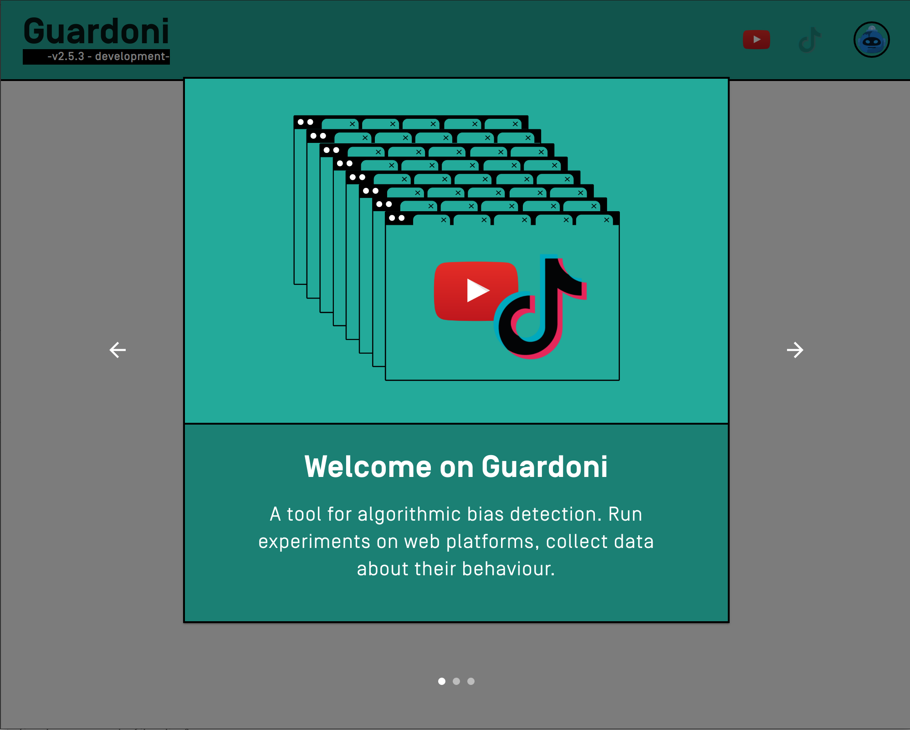
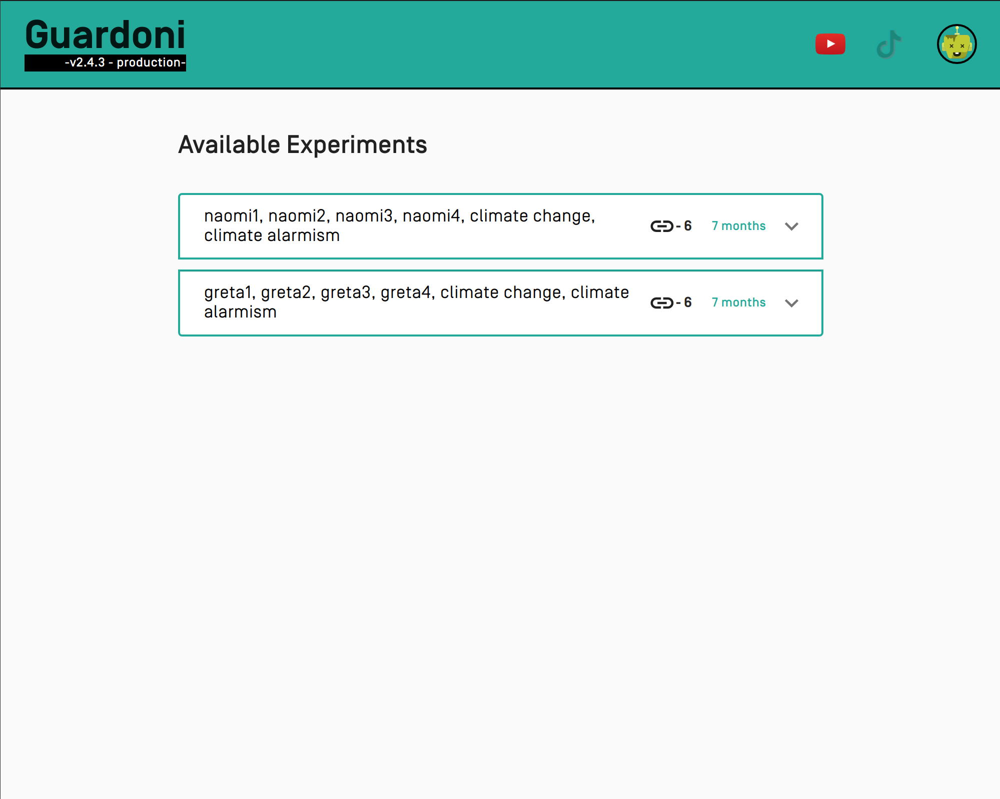
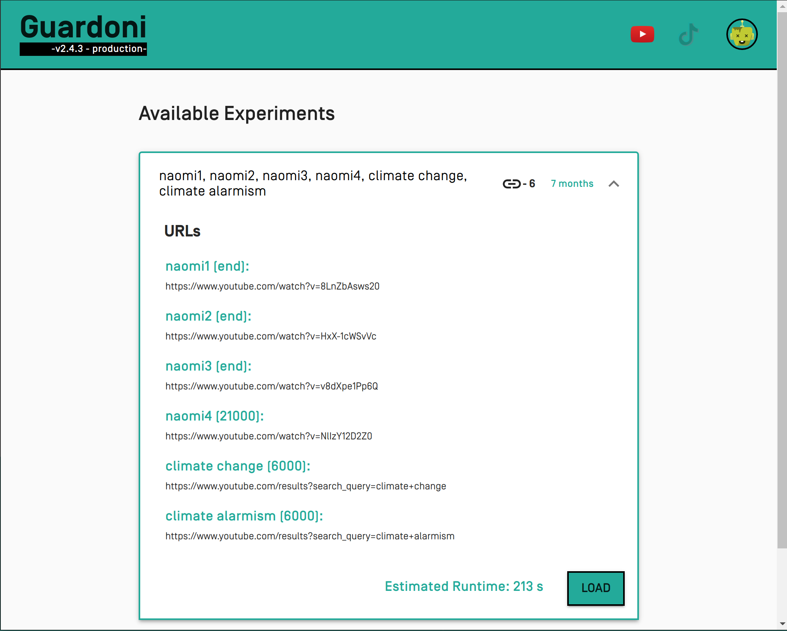
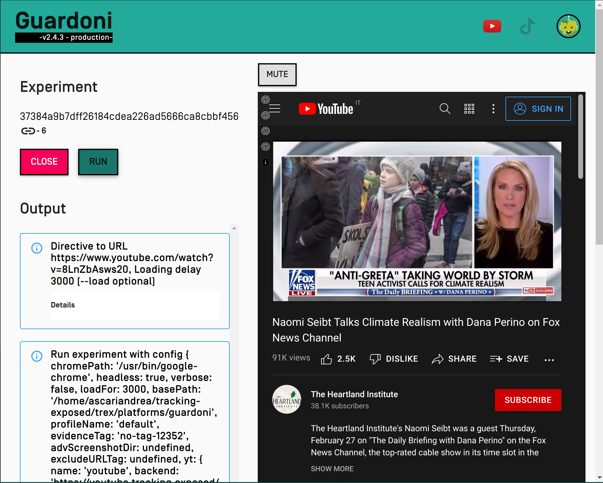

## First run

When you open **Guardoni** for the first time you will see a brief introduction about the tool and what it does. To continue to the application you have to accept our Terms Of Service in the last page.

The application saves all its data inside `~/.guardoni`:

- the `electron` folder contains data related to the electron app
- the `guardoni.config.json` contains the configuration loaded by guardoni (both electron and cli)
- the `profiles` folder contains all the profiles created - The default is `default`

## List experiments

The experiments list appears in the default page, when you open the app.

## Run an experiment

Open Guardoni and then select an experiment from the list:

Click on **"Run"** button in experiment page

